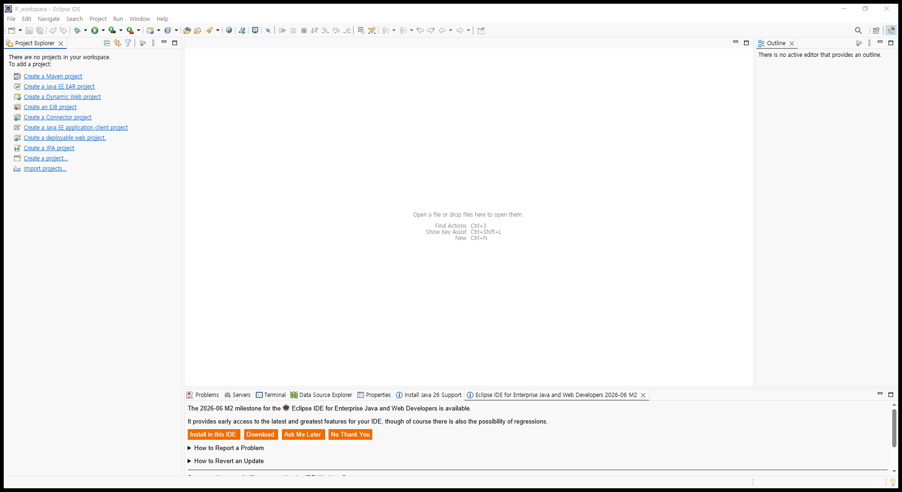
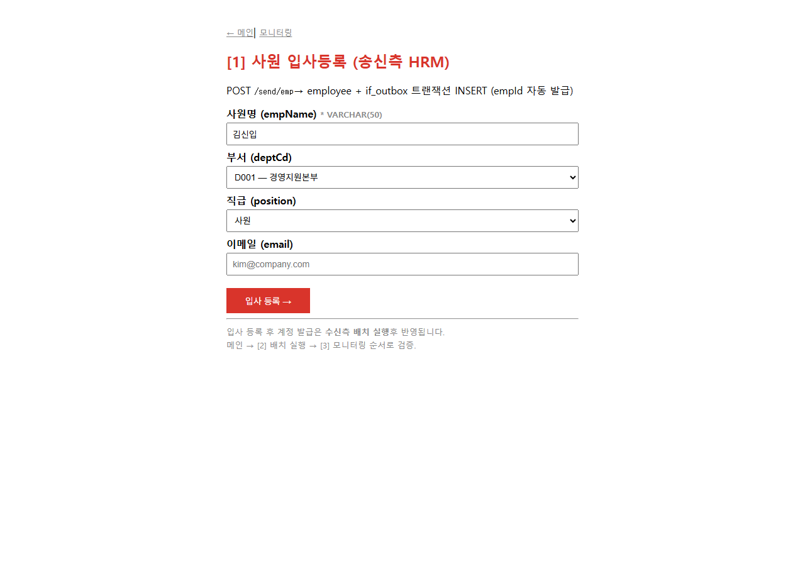
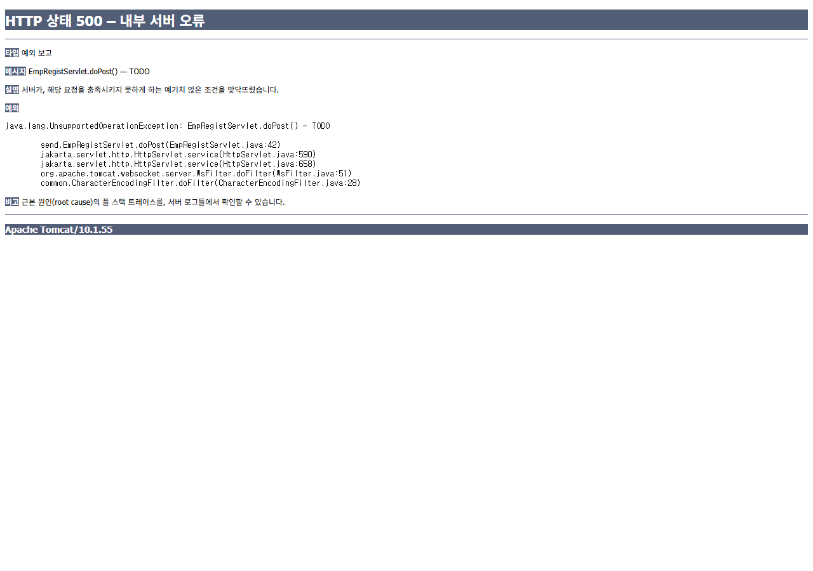
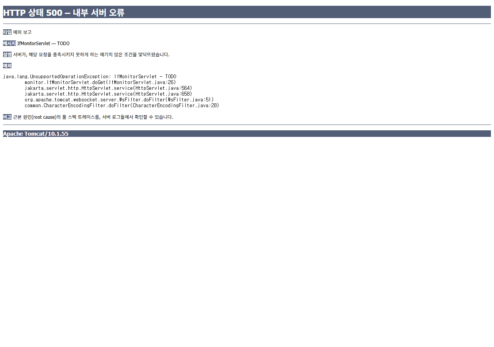
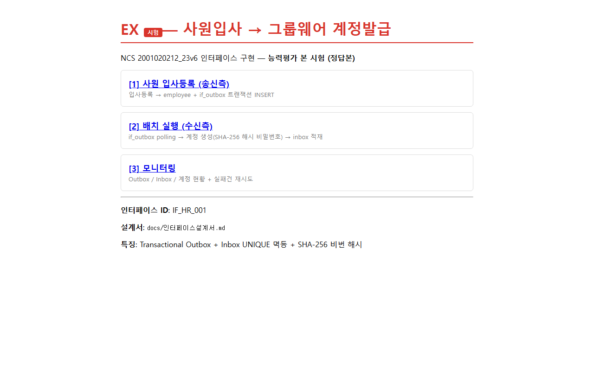
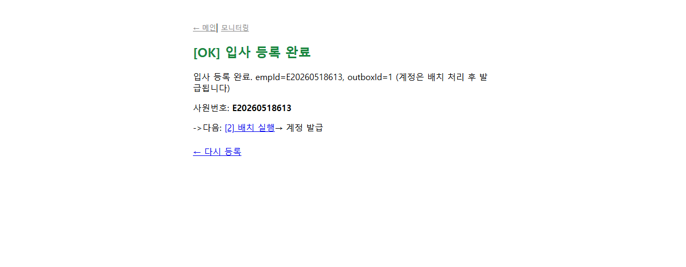
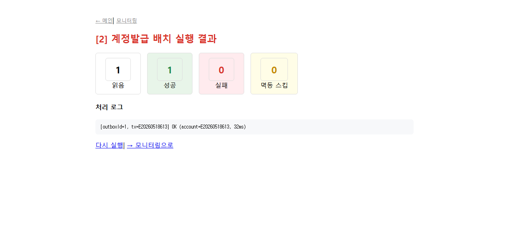
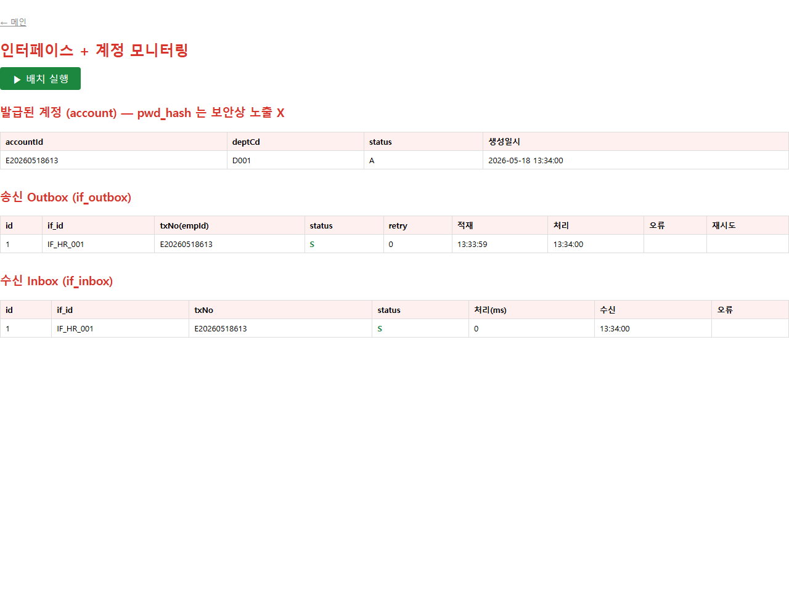

# [시험 EX] Eclipse 셋업 + Tomcat 연결 + 시연 가이드

> 학생이 EX 시험에 응시하기 위해 거치는 환경 셋업 과정.
> 단계별 화면을 `docs/screenshots_eclipse/` (Eclipse 화면) 및 `docs/screenshots_EX/` (완성 전/후 페이지) 에 캡처.

---

## 0. 사전 준비물

| 항목 | 버전 | 다운로드 |
|:---|:---|:---|
| JDK | 17+ (테스트: 21) | <https://adoptium.net> |
| MySQL | 8.x | <https://dev.mysql.com/downloads> |
| Eclipse | IDE for Enterprise Java and Web Developers (2025+) | <https://www.eclipse.org/downloads/packages/> |
| Apache Tomcat | 10.1.x (Jakarta EE 9+) | <https://tomcat.apache.org/download-10.cgi> |
| Chrome | 최신 | (테스트용) |

> **중요**: Tomcat 9 는 사용 불가 — 본 프로젝트는 `jakarta.servlet.*` 패키지 사용. Tomcat 10.1 이상 필수.

---

## 1단계 — Eclipse 실행 및 워크스페이스 선택

### 화면



### 설명
- Eclipse 실행 후 워크스페이스 선택 다이얼로그가 나타나면 임의의 폴더 선택 (예: `C:\Users\사용자\Documents\IF_workspace`)
- **빈 워크스페이스** 화면이 보이면 정상
- 좌측 **Project Explorer** 가 비어있는 상태에서 시작
- 하단 탭에 **Servers / Terminal / Data Source Explorer / Properties** 가 보여야 EE 버전이 맞음

---

## 2단계 — EX 프로젝트 Import

### 작업 순서

1. 메뉴: **File -> Import...** (또는 좌측 빈 Project Explorer의 `Import projects...` 링크 클릭)
2. **General -> Existing Projects into Workspace** 선택 -> `Next >`
3. **Select root directory:** 옆 `Browse...` -> `공공데이터융합풀스택과정_2026/10인터페이스 구현/EX` 선택
4. `Projects:` 목록에 `IfApp_EX_Practice` 체크됨을 확인 -> `Finish`
5. 좌측 Project Explorer 에 **IfApp_EX_Practice** 프로젝트가 나타남

### 확인 포인트
- 프로젝트 트리에서 `src` / `WebContent` / `WEB-INF` / `db` / `config` / `docs` 폴더 모두 보여야 정상
- `WebContent/WEB-INF/web.xml` 더블클릭 시 정상 열리면 OK

---

## 3단계 — JDBC + JSTL Jar 배치

`WebContent/WEB-INF/lib/` 폴더에 직접 복사:

| 파일 | 출처 |
|:---|:---|
| `mysql-connector-j-9.1.0.jar` | <https://dev.mysql.com/downloads/connector/j/> |
| `jakarta.servlet.jsp.jstl-api-3.0.0.jar` | maven central |
| `jakarta.servlet.jsp.jstl-3.0.1.jar` | maven central |

> 복사 후 Eclipse Project Explorer 에서 프로젝트 우클릭 -> `Refresh` (F5)

---

## 4단계 — MySQL 스키마 + db.properties 설정

```cmd
:: 1. DB + 사용자 생성
mysql -uroot -p < db\schema.sql

:: 2. properties 복사
copy config\db.properties.sample config\db.properties
```

-> `HrmDB` + `GroupwareDB` 두 데이터베이스, `ifuserx` 계정 자동 생성

---

## 5단계 — Tomcat Runtime 등록

### 작업 순서

1. 메뉴: **Window -> Preferences**
2. 좌측 트리: **Server -> Runtime Environments** 클릭
3. 우측 `Add...` -> **Apache -> Apache Tomcat v10.1** 선택 -> `Next >`
4. **Tomcat installation directory:** 옆 `Browse...` -> Tomcat 10.1 설치 폴더 선택
   (예: `C:\Users\사용자\Downloads\tomcat10\apache-tomcat-10.1.55`)
5. **JRE:** `JavaSE-17` 또는 `JavaSE-21` 선택 -> `Finish`
6. `Apply and Close`

---

## 6단계 — Tomcat 서버 생성 + 프로젝트 추가

### 작업 순서

1. 하단 **Servers** 탭 클릭 -> "No servers are available. Click this link to create a new server" 링크
2. **Apache -> Tomcat v10.1 Server** 선택 -> `Next >`
3. **Configured:** 비어있음. **Available:** `IfApp_EX_Practice` 선택 -> `Add >` -> `Finish`
4. Servers 탭에 `Tomcat v10.1 Server at localhost [Stopped]` 표시됨
5. 더블클릭 -> 우측 옵션:
   - **Server Locations** -> "Use Tomcat installation (takes control of Tomcat installation)" 선택
   - **Modules** 탭 -> `IfApp_EX_Practice` 의 Path가 `/IfApp_EX` 로 되어 있는지 확인

> 위 Server Location 옵션은 **반드시 서버가 Stopped 상태**일 때만 변경 가능. 변경 후 `Ctrl+S` 저장.

---

## 7단계 — Run on Server

### 작업 순서

1. Project Explorer 에서 `WebContent/index.jsp` 우클릭
2. **Run As -> Run on Server**
3. 처음 한 번은 서버 선택 다이얼로그 -> `Tomcat v10.1` 선택 -> `Finish`
4. Eclipse 내장 브라우저 또는 외부 Chrome 에서 자동으로 다음 URL 오픈:
   ```
   http://localhost:8080/IfApp_EX/
   ```

---

## 8단계 — 동작 확인

### A. 완성 전 (학생이 TODO 채우기 전)

#### A-1. 메인 페이지 — JSP 만 정상 동작

- 메인은 JSP 정적 HTML 만 사용하므로 **정상 렌더링**

#### A-2. 입사등록 폼 — 입력 가능

- 폼 자체는 정상. 단, 제출 후 Servlet 호출 시 에러 예상

#### A-3. 폼 제출 -> **500 에러** (TODO 미구현)

- 에러 메시지: `java.lang.UnsupportedOperationException: EmpRegistServlet.doPost() — TODO`
- -> **이 화면이 보이면 정상**. 학생이 `EmpRegistServlet.java` 의 TODO 를 채우면 사라짐.

#### A-4. 모니터링 -> **500 에러**

- `IfMonitorServlet — TODO` 예외

### B. 완성 후 (모든 TODO 채운 상태 = EX_답)

#### B-1. 메인 페이지


#### B-2. 입사 등록 성공

- `empId` 자동 생성됨 (예: `E20260518xxx`)
- "입사 등록 완료. 잠시 후 계정 발급됩니다" 안내

#### B-3. 배치 실행 결과

- 1 읽음 / 1 성공 / 0 실패 / 0 멱등스킵

#### B-4. 모니터링 (정상 처리됨)

- 발급된 계정: `E20260518xxx` / `D001` / `A`
- Outbox `status=S`, Inbox `status=S`
- **pwd_hash 컬럼은 화면에 노출되지 않음** (보안 학습 포인트)

---

## 9단계 — 합격 시연 시나리오 (CHECKLIST 매핑)

학생은 위 8단계 화면을 캡처하여 자가 평가 제출:

| 시연 | CHECKLIST 항목 | 배점 |
|:---|:---|---:|
| A-1, A-3 -> B-1, B-2 | 5, 6, 7 (송신측 트랜잭션 구현) | 19 |
| B-3 | 8, 9, 10 (배치 polling + 멱등) | 19 |
| B-4 | 11, 12 (예외처리 + PreparedStatement) | 13 |
| B-4 (pwd_hash 미노출) | 13 (모니터링 + 보안) | 6 |
| 추가 시나리오 (재고/직급 오류) | 14, 15, 16 | 18 |

-> 합격선: **60점 이상**

---

## 트러블슈팅

| 증상 | 원인 | 해결 |
|:---|:---|:---|
| `Failed to load class "org.slf4j.impl.StaticLoggerBinder"` | (무시 가능, 단순 로깅 경고) | - |
| `Public Key Retrieval is not allowed` | MySQL 8 caching_sha2_password | properties 에 `allowPublicKeyRetrieval=true` (이미 포함됨) |
| 한글 깨짐 | 폼 인코딩 | `CharacterEncodingFilter` 가 `/*` 매핑됐는지 확인 |
| `config/db.properties 를 읽을 수 없습니다` | Tomcat 작업 디렉토리 | Eclipse `Run on Server` 시 자동으로 Tomcat 폴더에서 실행됨. 외부 실행 시 cd 후 startup |
| Tomcat 시작 안 됨 | 포트 8080 충돌 | 다른 Tomcat 종료, 또는 `server.xml` 에서 포트 변경 |
| JSP `${r.outboxId}` `PropertyNotFoundException` | VO 에 getter 없음 | OutboxDAO.Outbox 내부에 getter 추가 (정답본은 이미 적용됨) |

---

**문서 끝.**
